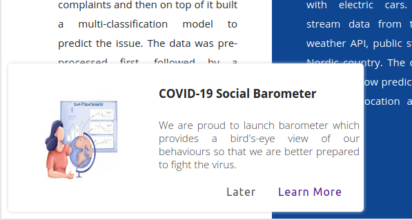

# Web Floating Dialog

A dialog plugin to alert your website users about any important information.

## Motivation
Inspired from paper dialog seen on YouTube during COVID-19 outbreak.

## How to integrate?

#### Using NPM:
* Install package.

    `npm i robomx-webdialogalert`

* Add import.

    `import 'robomx-webdialogalert/dist/webdialogalert.min';`

### Using JS script:
* Add following line to bottom of your body tag.

    ``

Last add the tag:

`robomx-webdialogalert` tag before script file.
    Example:

        <robomx-webdialogalert
            title="Dialog title"
            description="Dialog description"
            imgSrc="sample.png"
            imgWidth="300px"
            imgHeight="200px"
            position="bottom-left"
            link="example.com"
            actionText="Learn More"
            actionTarget="_blank"
            dismissText="Later"
        ></robomx-webdialogalert>

## Output:

## Variables

| Attribute | Default | Accepts | Note|
| --------- | ------- | --------|------- |
| `title`     | `Dialog title` | `string content`  | Specify title of the dialog |
| `description` | `Dialog description ` |  `string content` | Give brief information about the dialog.  |
| `actionText` | `Learn More` | `string content` | `Action button text |
| `imgSrc`  | `null` | `Image path` | Specify image source url or relative path. |
| `imgWidth`     | `300px` |    `px, em, %`     | Specify width of the image. |
| `imgHeight`    | `200px` | `px, em, %` | Specify height of the image. |
| `position`        | `bottom-left`  | `top-left, top-right, bottom-left, bottom-right, center`     | Specify position of the dialog box.       |
| `darkMode`        | `false`  | `boolean`     | Dark mode setup.       |
| `bgColor`        | `#fff`  | `Hex Code, RGB`     | Backgroung color of dialog box.       |
| `txtColor`        | `#373737`  | `Hex Code, RGB`     | Text color of dialog content. |
| `btnColor`        | `#6c6b6b`  | `Hex Code, RGB`     | Button color of 'Later'.       |
| `link`        | `http://example.com`  | `URL`     | URL for action button.       |
| `actionTarget`        | `_blank`  | `_blank, _self, _parent, _top`     | Target tab of action button.       |
| `dismissText`        | `Later`  | `string word`     | Dismiss button text.       |
